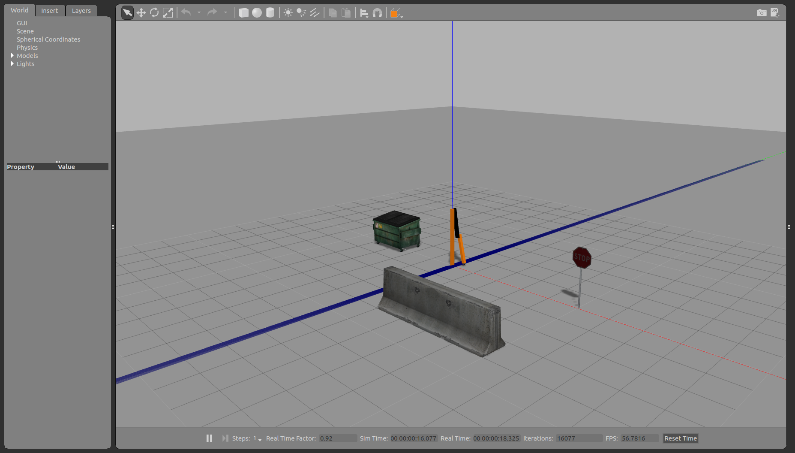

## Homework 3: Gazebo and ROS Control
#### ME 495: Embedded Systems in Robotics
#### _Ben Don_

## Introduction

## Part 2: `rrbot` and ROS interfacing

### 1: World File
#### [This links to the world I created for RRbot](https://github.com/ME495-EmbeddedSystems/homework-3-f2017-benbdon/blob/starter/worlds/my_world.sdf)

### 2: Launch file with screenshot
#### [This links to the launch file I created for RRbot](https://github.com/ME495-EmbeddedSystems/homework-3-f2017-benbdon/blob/starter/launch/rrbot_world.launch)

### RRBOT in world

 

 

### 3: `image_view`
#### a) What command was used to start your image viewer?
##### `rosrun image_view image_view image:=/rrbot/camera1/image_raw`

#### b) What is the name of the plugin responsible for simulating the camera?
##### The plugin is called 'camera_controller`

#### c) What topic is the simulated image published on and where was this topic name defined?
##### `/rrbot/camera1/image_raw` is where the camera images publish. The topic name was defined in the `rrbot.gazebo` file.

### 4: Laser scanner
#### [This links to the launch file](https://github.com/ME495-EmbeddedSystems/homework-3-f2017-benbdon/blob/starter/launch/rrbot_world.launch)

#### [This links to the rviz config file](https://github.com/ME495-EmbeddedSystems/homework-3-f2017-benbdon/blob/starter/launch/rrbot.rviz)

#### Default noise

 

 

#### Slightly more noise (laser shows a wider spread of points)

 

 

#### In order to visualize the laser in gazebo, I had to change the name of the ros laser in the `rrbot.gazebo` file per directions in the homework.
## Part 3: ROS control, ROS communication, and custom plugins
### 1 ROS Control
#### [This links to the joint state controller config file (YAML)](https://github.com/ME495-EmbeddedSystems/homework-3-f2017-benbdon/blob/starter/config/rrbot_control.yaml)
#### [This links to the controller launch file](https://github.com/ME495-EmbeddedSystems/homework-3-f2017-benbdon/blob/starter/launch/rrbot_control.launch)
#### To run the two launch files type the following commands:
#### `roslaunch rrbot_control_me495 rrbot_world.launch`
#### `roslaunch rrbot_control_me495 rrbot_control.launch`

### 2 Apply Torque for 5 seconds on joint 1 and then release this torque
#### [This links to the node `joint_effort_to_torque.py`](https://github.com/ME495-EmbeddedSystems/homework-3-f2017-benbdon/blob/starter/src/joint_effort_to_torque.py)
#### Directions to run below:
#### `roslaunch rrbot_control_me495 rrbot_world.launch`
#### `rosrun rrbot_control_me495 joint_effort_to_torque.py`

### 3 Custom Plugin for URDF
#### 1. The custome message this plugin subscribes to is `rrbot_ref_joint_config`
#### 2. [This links to custom launch file](https://github.com/ME495-EmbeddedSystems/homework-3-f2017-benbdon/blob/starter/launch/custom_plugin.launch)
#### 3. I had to add a few lines to the rrbot.gazebo file. The plugin name was `rrbot_custom`. This name was listed in the CMakeLists.txt file.

## Part 4: ROS node publishes custom message on the correct topic
#### I'm not sure which topics to remap the outputs of my node to. I did create the launch file. [This links to custom launch file](https://github.com/ME495-EmbeddedSystems/homework-3-f2017-benbdon/blob/starter/launch/custom_plugin.launch) and the node is [here. ](https://github.com/ME495-EmbeddedSystems/homework-3-f2017-benbdon/blob/starter/src/joint_publisher.py)
